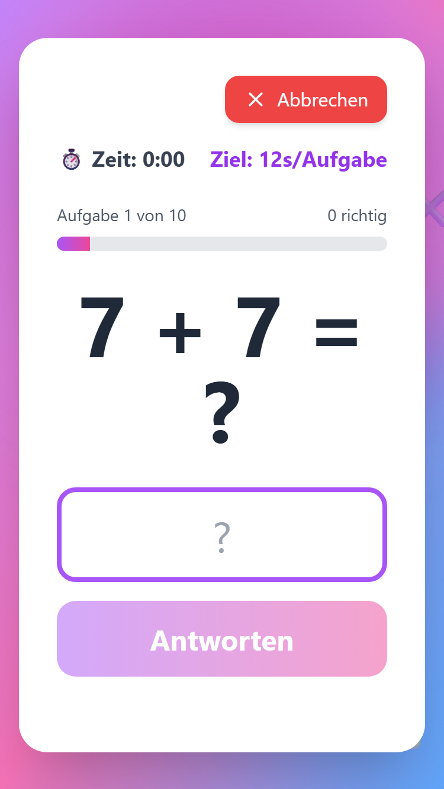
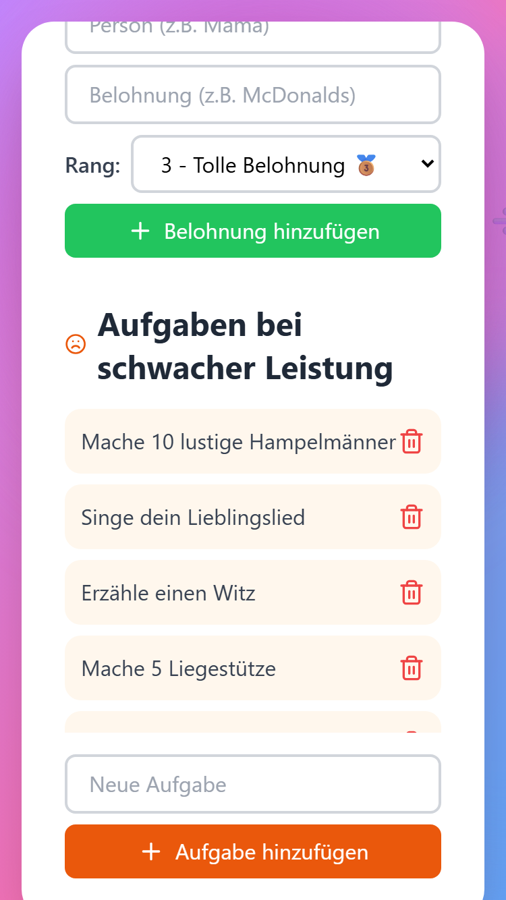

# 🧮 Math4Kids - Kopfrechnen-Lernapp

Eine motivierende Progressive Web App (PWA) und native Android-App für Kinder von Klasse 1-4 zum Üben von Kopfrechnen.

## 📥 Download

**[⬇️ Android APK herunterladen (v1.0.0)](releases/Math4Kids-v1.0.0.apk)** - Direkt installierbar auf Android-Geräten

**[🌐 Web-App ausprobieren](https://schurick1502.github.io/Math4Kids/)** - Läuft direkt im Browser

## 📸 Screenshots

<p align="center">
  
  
  
</p>

## ✨ Features

### 🎯 Spielmechanik
- **4 Klassenstufen** mit steigendem Schwierigkeitsgrad
- **10 Aufgaben** pro Runde
- **3 Leben** - Fehler oder Timeout kostet ein Leben
- **Countdown-Timer** für jede Aufgabe (visuell animiert)
- **Sofortiges Feedback** bei jeder Antwort
- **Fortschrittsbalken** zur Orientierung
- **Performance-Optimierung** für ältere Geräte

### 🏆 Motivationssystem
- **Belohnungen** bei ≥90% richtigen Antworten (personalisierbar)
- **Lustige Strafaufgaben** bei <90% (motivierend, nicht demotivierend)
- **CRUD-Funktionen** zum Verwalten von Belohnungen und Strafaufgaben
- **Persistente Speicherung** aller Daten im Browser

### 📱 Multi-Platform Support

#### 🌐 Progressive Web App (PWA)
- **Offline-fähig** dank Service Worker
- **Installierbar** auf Smartphone und Tablet
- **Responsive Design** für alle Bildschirmgrößen
- **Touchscreen-optimiert** für mobile Geräte

#### 🤖 Native Android App
- **APK-Datei** für direkte Installation
- **AAB-Datei** für Google Play Store
- **Capacitor-basiert** für native Performance
- **Vollständig signiert** für Play Store Release

#### 💻 Web-Version
- **HTTP-Server** für lokale Nutzung
- **USB-Stick Installation** möglich
- **Browser-optimiert** (Chrome, Firefox, Safari)

### 🎨 Klassenstufen im Detail

**Klasse 1:**
- Rechenarten: Plus (+) und Minus (-)
- Zahlenbereich: 1-10
- Zeit pro Aufgabe: 30 Sekunden

**Klasse 2:**
- Rechenarten: Plus (+) und Minus (-)
- Zahlenbereich: 1-20
- Zeit pro Aufgabe: 25 Sekunden

**Klasse 3:**
- Rechenarten: Plus (+), Minus (-), Mal (×)
- Zahlenbereich: 1-100 (Multiplikation: 1-10 × 1-10)
- Zeit pro Aufgabe: 20 Sekunden

**Klasse 4:**
- Rechenarten: Plus (+), Minus (-), Mal (×), Geteilt (÷)
- Zahlenbereich: 1-1000 (Multiplikation/Division: bis 12)
- Zeit pro Aufgabe: 15 Sekunden

## 🚀 Schnellstart

### Voraussetzungen
- **Node.js** (Version 16 oder höher)
- **npm** oder yarn
- Für Android: **Android Studio** und **JDK**

### 1. Projekt klonen und installieren

```bash
git clone https://github.com/schurick1502/Math4Kids.git
cd Math4Kids
npm install
```

### 2. Development Server starten

```bash
npm run dev
```

Die App läuft dann unter `http://localhost:5173`

## 📦 Deployment-Optionen

### 🌐 Web-App (PWA)

#### Option A: Lokaler HTTP-Server
```bash
npm run build
npm run serve:dist
```
Die App läuft dann auf `http://localhost:8080` und ist im lokalen Netzwerk erreichbar.

#### Option B: USB-Stick Installation
1. `npm run build` ausführen
2. `dist/` Ordner auf USB-Stick kopieren
3. `index.html` auf dem Smartphone öffnen

Siehe `SCHNELLSTART-USB.md` für Details.

#### Option C: PWA installieren
1. App im Browser öffnen (über HTTPS)
2. "Zum Startbildschirm hinzufügen" wählen
3. App kann offline genutzt werden

Siehe `PWA-INSTALLATION.md` für Details.

### 🤖 Android App

#### Debug-APK erstellen
```bash
npm run apk:debug
```
APK liegt in: `android/app/build/outputs/apk/debug/app-debug.apk`

#### Release-APK erstellen (signiert)
```bash
npm run apk:release
```
APK liegt in: `android/app/build/outputs/apk/release/app-release.apk`

#### AAB für Google Play Store erstellen
```bash
npm run aab:release
```
AAB liegt in: `android/app/build/outputs/bundle/release/app-release.aab`

**⚠️ Wichtig:** Für Release-Builds muss ein Keystore konfiguriert sein.
Siehe `SIGNING-EINRICHTEN.md` für Details.

### 📱 Android Studio Development

```bash
npm run build:android  # Build und Sync
npm run android        # Android Studio öffnen
```

Siehe `ANDROID-INSTALLATION.md` für vollständige Anleitung.

## 📚 Detaillierte Anleitungen

### 🚀 Schnellstart-Anleitungen
- `START-HIER.md` - Kompletter Einstieg für Android
- `SCHNELLSTART-HTTP-SERVER.md` - Lokaler HTTP-Server
- `SCHNELLSTART-USB.md` - USB-Stick Installation
- `SO-STARTEST-DU-DIE-APP.md` - Übersicht aller Methoden

### 🤖 Android
- `ANDROID-INSTALLATION.md` - Vollständige Android Setup-Anleitung
- `APK-ERSTELLEN.md` - APK erstellen (detailliert)
- `APK-SCHNELLSTART.md` - APK erstellen (schnell)
- `AAB-FERTIG.md` - AAB für Play Store erstellen
- `SIGNING-EINRICHTEN.md` - Keystore und Signing einrichten
- `KEYSTORE-ERSTELLEN.md` - Keystore Schritt für Schritt
- `ANDROID-STUDIO-FIX.md` - Häufige Probleme lösen

### 🌐 Web & PWA
- `PWA-INSTALLATION.md` - PWA installieren
- `CHROME-BERECHTIGUNGEN.md` - Chrome-Berechtigungen für PWA
- `ICONS-ERSTELLEN.md` - App-Icons erstellen

### 🛠️ Tools
- `generate-android-icons.html` - Icon-Generator für Android

## 🛠️ Technologie-Stack

### Frontend
- **React 18** - UI Framework
- **Vite** - Build Tool (schnell, optimiert)
- **Tailwind CSS** - Utility-first CSS Framework
- **lucide-react** - Icon Library

### Mobile
- **Capacitor** - Native Mobile Bridge
- **Android** - Native Android Support

### Build & Optimierung
- **Terser** - JavaScript Minification
- **Code Splitting** - Optimierte Bundle-Größe
- **Service Worker** - Offline-Funktionalität
- **Performance-Optimierung** - Angepasst für ältere Geräte

### Speicherung
- **localStorage** - Persistente Datenspeicherung im Browser

## 📂 Projektstruktur

```
Math4Kids/
├── public/
│   ├── index.html          # HTML Template
│   ├── manifest.json       # PWA Manifest
│   ├── service-worker.js   # Service Worker für Offline
│   └── icon-*.png          # App Icons
├── src/
│   ├── App.jsx            # Hauptkomponente mit kompletter Logik
│   ├── main.jsx           # Entry Point
│   └── index.css          # Global Styles (Tailwind)
├── android/                # Android Projekt (Capacitor)
│   ├── app/
│   │   ├── src/main/      # Android Source Code
│   │   └── build.gradle   # Android Build Config
│   └── gradle.properties  # Gradle Settings
├── capacitor.config.json   # Capacitor Konfiguration
├── vite.config.js         # Vite Build Konfiguration
├── tailwind.config.js     # Tailwind Konfiguration
├── server.js              # HTTP Server für lokale Nutzung
├── package.json           # Dependencies & Scripts
└── README.md              # Diese Datei
```

## 📋 Verfügbare Scripts

### Development
```bash
npm run dev          # Development Server starten
npm run build        # Production Build erstellen
npm run preview      # Production Build lokal testen
```

### Web Server
```bash
npm run serve        # HTTP Server (Root-Verzeichnis)
npm run serve:dist   # HTTP Server (dist/ Verzeichnis)
```

### Android
```bash
npm run build:android   # Web Build + Android Sync
npm run android         # Android Studio öffnen
npm run sync:android    # Nur Android Sync
npm run apk:debug       # Debug-APK erstellen
npm run apk:release     # Release-APK erstellen
npm run aab:release     # AAB für Play Store erstellen
```

## 🎨 Icons erstellen

Die App benötigt Icons in verschiedenen Größen. Siehe `ICONS-ERSTELLEN.md` für Details.

**Kurzfassung:**
1. Öffne `generate-android-icons.html` im Browser
2. Generiere Icons
3. Speichere sie im `public/` Ordner

## 🧪 Testing

### Web-Version
- [x] Alle 4 Klassenstufen durchspielen
- [x] Belohnungen hinzufügen/löschen
- [x] Strafaufgaben hinzufügen/löschen
- [x] Timeout-Verhalten prüfen
- [x] Leben aufbrauchen
- [x] 90%+ Score erreichen
- [x] Unter 90% Score erreichen
- [x] Offline-Funktionalität testen
- [x] PWA-Installation testen

### Android-Version
- [x] APK auf Gerät installieren
- [x] AAB für Play Store erstellen
- [x] Signing konfigurieren
- [x] Performance auf älteren Geräten testen

## 🐛 Bekannte Probleme & Lösungen

### Problem: App installiert sich nicht (PWA)
**Lösung:** PWAs funktionieren nur über HTTPS. Nutze einen Hosting-Service (Netlify, Vercel) oder den lokalen HTTP-Server.

### Problem: Daten gehen verloren
**Lösung:** Stelle sicher, dass der Browser keine Cookies/localStorage löscht. In privaten Browsing-Modi werden Daten nicht gespeichert.

### Problem: Android Studio öffnet nicht
**Lösung:** Siehe `ANDROID-STUDIO-FIX.md` für Troubleshooting.

### Problem: Gradle Build schlägt fehl
**Lösung:** 
1. Prüfe ob JDK korrekt konfiguriert ist
2. Lösche `.gradle` und `build` Ordner
3. Führe `npm run build:android` erneut aus

### Problem: "Keystore nicht gefunden"
**Lösung:** Siehe `KEYSTORE-ERSTELLEN.md` für Anleitung zum Erstellen eines Keystores.

## 💡 Tipps für Eltern

### Personalisierung
- Füge die Lieblingsbelohnungen deines Kindes hinzu
- Passe die Strafaufgaben an das Alter und die Interessen an
- Halte die Strafaufgaben spielerisch und motivierend

### Verwendung
- Beginne mit der passenden Klassenstufe (nicht zu schwer!)
- Übe regelmäßig, aber in kurzen Sessions (10-15 Minuten)
- Feiere Erfolge gemeinsam!

### Performance
- Die App ist optimiert für ältere Geräte
- Bei Problemen: Reduziere Animationen in den Browser-Einstellungen
- Nutze die PWA-Version für beste Performance

## 🤝 Beitragen

Verbesserungsvorschläge und Bug Reports sind willkommen!

1. Fork das Repository
2. Erstelle einen Feature-Branch
3. Committe deine Änderungen
4. Push zum Branch
5. Öffne einen Pull Request

## 📝 Lizenz

Dieses Projekt ist Open Source und steht zur freien Verfügung.

## 🙏 Danksagungen

- **React Team** für das großartige Framework
- **Vite Team** für das schnelle Build-Tool
- **Capacitor Team** für die Native Mobile Bridge
- **Tailwind CSS** für das Utility-First CSS Framework

---

## 🚀 Nächste Schritte

1. **Klonen:** `git clone https://github.com/schurick1502/Math4Kids.git`
2. **Installieren:** `npm install`
3. **Starten:** `npm run dev`
4. **Entwickeln:** Viel Spaß! 🎉

**Viel Spaß beim Kopfrechnen! 🎉**
